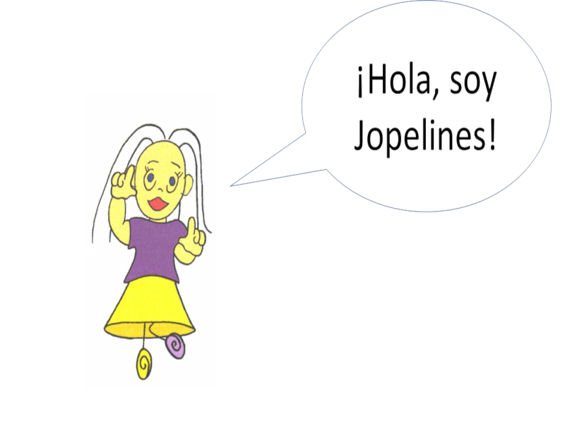
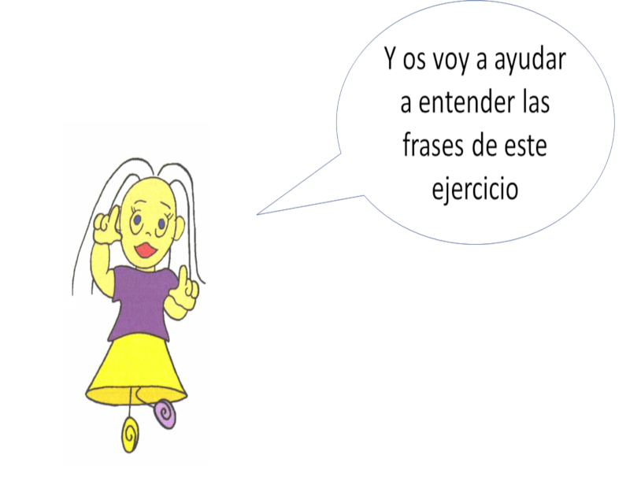
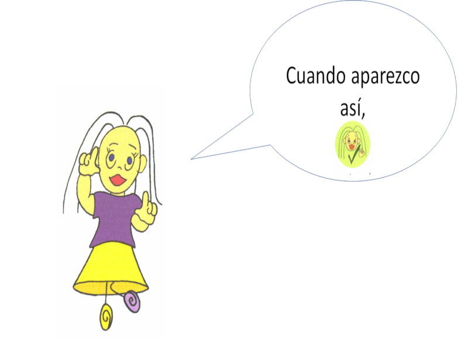
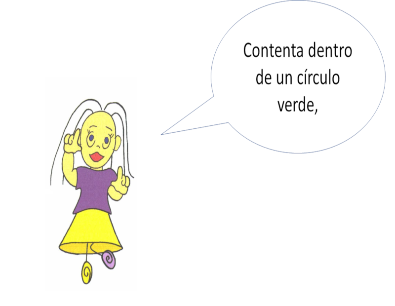
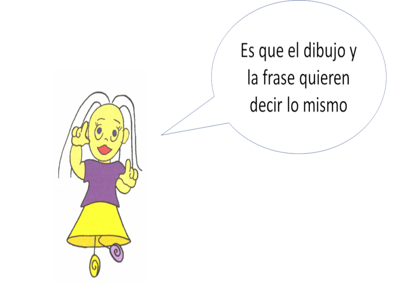
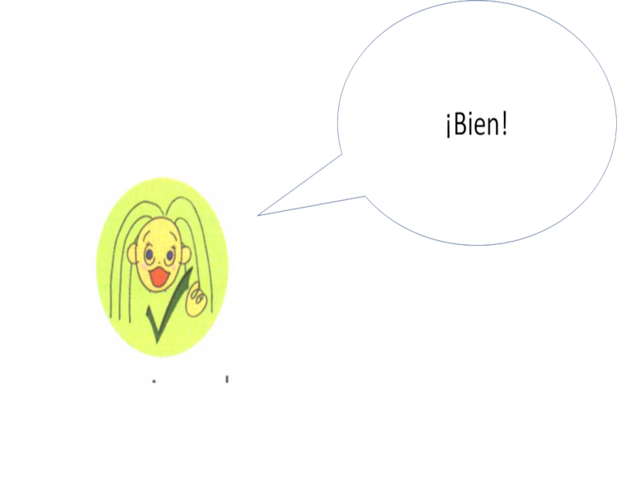
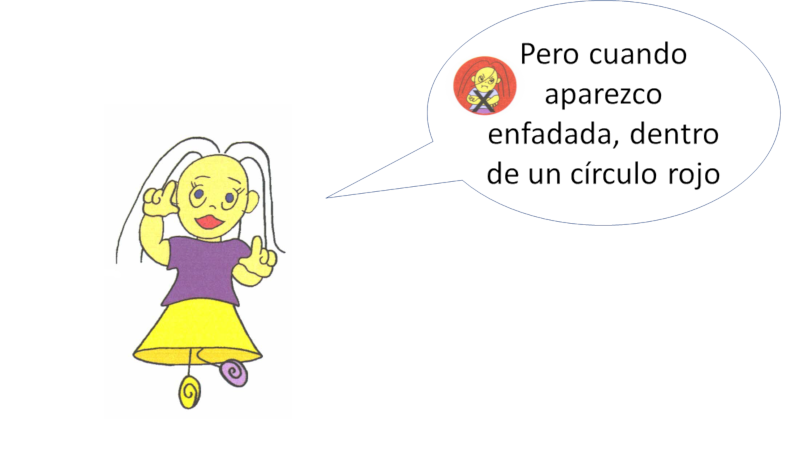
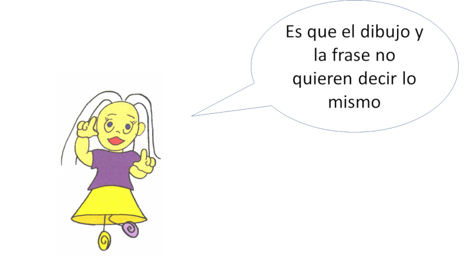
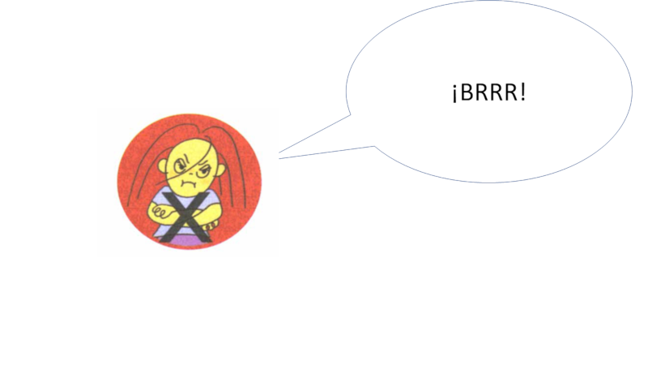
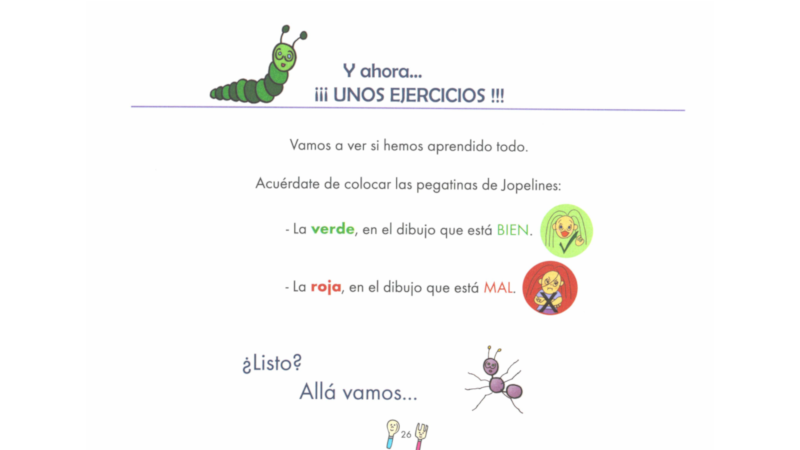

<!DOCTYPE HTML PUBLIC "-//W3C//DTD HTML 4.0 Transitional//EN">
<html lang="es">
<head>
<meta charset="UTF-8"/>
<meta name="keywords" content=""/>
<title></title>
<meta name="viewport" content="width=device-width, initial-scale=1.0">
<link rel="stylesheet" href="./sclim/lim.css?5.4" type="text/css" ></link>

</head>
<body >
   

      

   <button class="pclbtbr"></button>
   

      
			 
         <button class="pclbot lbt-full" >&#9713;</button>
         <button class="pclbot lbt-infor" >i</button>
         <button class="pclbot lbt-menu" >&#9636;</button>
         <button class="pclbot lbt-axd" >?</button>
      

      
1

      

         <button class="pclbot nav lbt-bck"></button>
         <button class="pclbot nav lbt-frw"></button>  						            
      

   

   

   

      

      

      

      

      

<!-- pi -->
	  
         
	<!-- 1 -->
         

            

               

		 
 

	       

            

         

	<!--  -->
<!-- 2 -->
         

            

               

		 
 

	       

            

         

	<!--  -->
<!-- 3 -->
         

            

               

		 
 

	       

            

         

	<!--  -->
<!-- 4 -->
         

            

               

		 
 

	       

            

         

	<!--  -->
<!-- 5 -->
         

            

               

		 
 

	       

            

         

	<!--  -->
<!-- 6 -->
         

            

               

		 
 

	       

            

         

	<!--  -->
<!-- 7 -->
         

            

               

		 
 

	       

            

         

	<!--  -->
<!-- 8 -->
         

            

               

		 
 

	       

            

         

	<!--  -->
<!-- 9 -->
         

            

               

		 
 

	       

            

         

	<!--  -->
<!-- 10 -->
         

            

               

		
	       

            

         

	<!--  -->
<!-- 11 -->
         

            

               

		 
 

	       

            

         

	<!--  -->
<!-- 12 -->
         

            

               

		
	       

            

         

	<!--  -->
<!-- 13 -->
         

            

               

		
	       

            

         

	<!--  -->
<!-- 14 -->
         

            
1. Lee cada frase y piensa en qué situaciones tú pondrías los ojos como platos, o sea, ¡¡ super abiertos!!  ","respuestas":["Mis amigos me han preparado una tarta por mi cumpleaños.","Me asomo a la ventana y veo que está lloviendo."," ¡Ayer vi una puesta de sol preciosa!","Me pongo pijama para ir a la cama."],"corr":"1010"}}'>
               

		
	       

            

         

	<!--  -->
<!-- 15 -->
         

            

               

		
	       

            

         

	<!--  -->
<!-- 16 -->
         

            

               

		
	       

            

         

	<!--  -->

      

   

</body>
</html>
